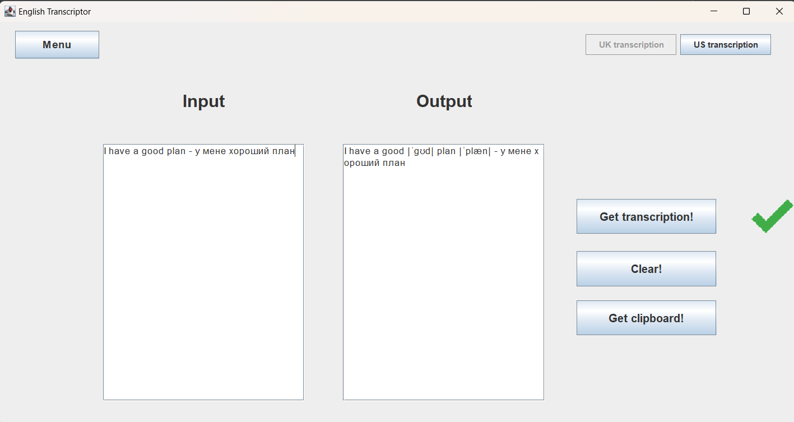
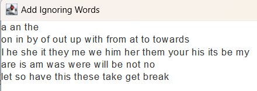

<h1 align="center">English Transcriptor</h1>

## Project Goal

Develop a convenient application for obtaining transcriptions of English words. Now, instead of constantly checking each word individually on the Internet, users can immediately get transcriptions for many words at once. This is especially useful for those who are learning the English language, as it allows for efficient pronunciation practice without spending precious time searching for information.

## How to Use

The application has two text blocks for input and output. After entering text, you can press the **"Get transcription!"** button, after which the program will start searching for transcriptions for all English words in the text. As a result, the output field will display the original text with transcriptions.

You can choose which transcriptions the application will search for: **UK** or **US**. By clicking **Menu**, you can go to **Ignoring words** and add words that will be ignored when searching for transcriptions.

## Installation Requirements

For the application to work correctly, you need to have JDK 17 or higher installed.

## Executable File

The working version of the application can be found at **app/EnglishTranscriptor.jar**.

## Technology Stack

- Java 17
- Maven
- Swing (for the user interface)
- Jsoup (for retrieving data from the Internet)
- Stream API (for data processing in streaming mode)

## Suggested Additions to Ignored Words

a an the

on in by of out up with from at to towards

I he she it they me we him her them your his its be my

are is am was were will be not no

would must

let so have this these take get break

## Example

