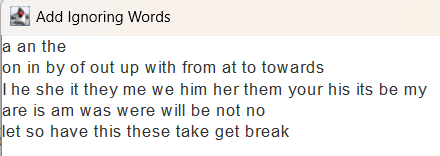

<h1 align="center">English Transcriptor</h1>

## Мета цього проекту

Розробити зручний додаток для отримання транскрипцій англійських слів.
Тепер, замість постійного перевіряння кожного слова окремо в Інтернеті, користувачі можуть одразу отримувати транскрипції для багатьох слів одночасно.
Це особливо зручно для тих, хто вивчає англійську мову, оскільки дозволяє ефективно опановувати вимову слів без витрати дорогоцінного часу на пошук інформації.

## Як користуватись?

Застосунок має два текстові блоки для вводу тексту та його виводу.
Після введення тексту, Ви можете натиснути кнопку **"Get transcription!"**,
після чого програма почне шукати транскрипції для всіх англійських слів, які були в тексті.
Як результат в полі виводу буде отриманий попередній текст з транскрипціями.

Можна вибрати які саме транскрипції застосунок буде шукати: **UK** або **US**.
Викликавши **Menu**, можна зайти в **Ignoring words** та додати слова, які будуть проігноравані при пошуку транскрипційю

## Вимоги до встановлення

Для коректної роботи застосунку має бути встановлено jdk 17 або вище.

## Виконавчий файл

Робоча версія застосунку знаходиться за шляхом **app/EnglishTranscriptor.jar**.

## Технологічний стек

- Java 17
- Maven
- Swing (для інтерфейсу користувача)
- Jsoup (для отримання даних з Інтернету)
- Stream API (для обробки даних у потоковому режимі)

## Пропоную додати такі винятки до ігноруємих слів:

a an the

on in by of out up with from at to towards

I he she it they me we him her them your his its be my

are is am was were will be not no

would must

let so have this these take get break

## Приклад

