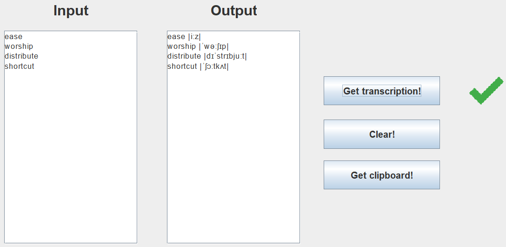
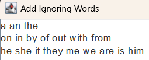

<h3 align="center">English Transcriptor</h3>

**Мета цього проекту** - розробити зручний додаток для отримання транскрипцій англійських слів. Тепер, замість постійного перевіряння кожного слова окремо в Інтернеті, користувачі можуть одразу отримувати транскрипції для багатьох слів одночасно. Це особливо зручно для тих, хто вивчає англійську мову, оскільки дозволяє ефективно опановувати вимову слів без витрати дорогоцінного часу на пошук інформації.

**Вимоги до встановлення** - Для коректної роботи застосунку має бути встановлено jdk 17 або вище.

**Виконавчий файл** - Робоча версія застосунку знаходиться за шляхом out/artifacts/EnglishTranscriptor_jar/EnglishTranscriptor.jar

**Технологічний стек**
- Java 17
- Maven
- Swing (для інтерфейсу користувача)
- Jsoup (для отримання даних з Інтернету)
- Stream API (для обробки даних у потоковому режимі)

**Приклад**

